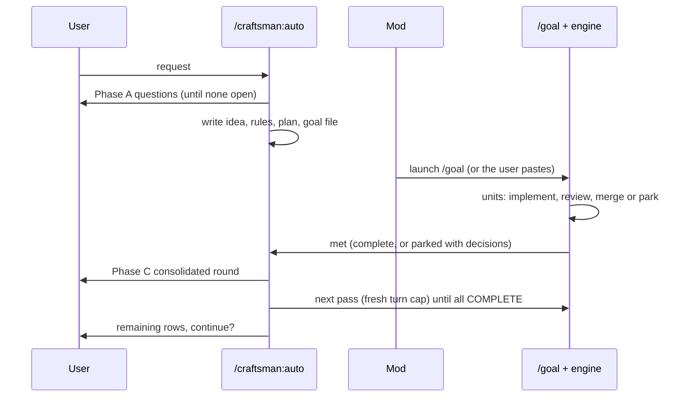

> **Human reference.** The loop never reads this file. What it enforces lives in
> [`auto.rules.md`](./auto.rules.md); if the two disagree, the rules file wins
> and `/architect --update auto` should be run.

# Auto architecture
_Last verified: 2026-10-09 at `d7da89f` · Source idea: [autonomous-e2e-loop](../ideas/autonomous-e2e-loop.md)_

## In plain English
`/craftsman:auto <request>` is the one command that takes work from an idea
to landed code. It runs in three phases:
- **Phase A** asks every open decision up front, using the `/idea`,
  `/architect` and `/plan` logic.
- **Phase B** runs unattended under `/goal`.
- **Phase C** brings everything that needs the user into one round: parked
  decisions, review findings that need judgement, and rows still open.

It then re-enters Phase B until every tracker row is COMPLETE. It always
finishes by saying what remains and asking whether to continue.

## How it fits

## Decisions
| id | decision | why | rejected alternatives |
|---|---|---|---|
| ARCH-AUTO-01 | Single entry, three phases | User: questions only before and after | A mod-only command (questions need a model turn) |
| ARCH-AUTO-02 | Never default an open decision | User requirement | Assume and record |
| ARCH-AUTO-03 | Always end with what remains and a prompt to continue | User requirement | Stop silently |
| ARCH-AUTO-04 | Goal accepts parked rows plus a Phase C round as a met stop | Otherwise the evaluator reads parked as unmet or impossible | — |
| ARCH-AUTO-05 | Fresh turn cap per pass | Each pass is bounded; Phase C surfaces any runaway | One cap for the whole run |
| ARCH-AUTO-06 | The guard treats `/auto` like `/orchestrate` | Scope and acceptance enforcement apply | — |
| ARCH-AUTO-07 | Paste fallback | `-p`, VS Code, and installs without mods | — |

## Trade-offs & known limits
Phase A can be long: by design it asks everything. Unknown decisions that
only surface mid-run still park, which costs a Phase C round.

## Glossary
- **Pass**: one Phase B run under one `/goal`.
