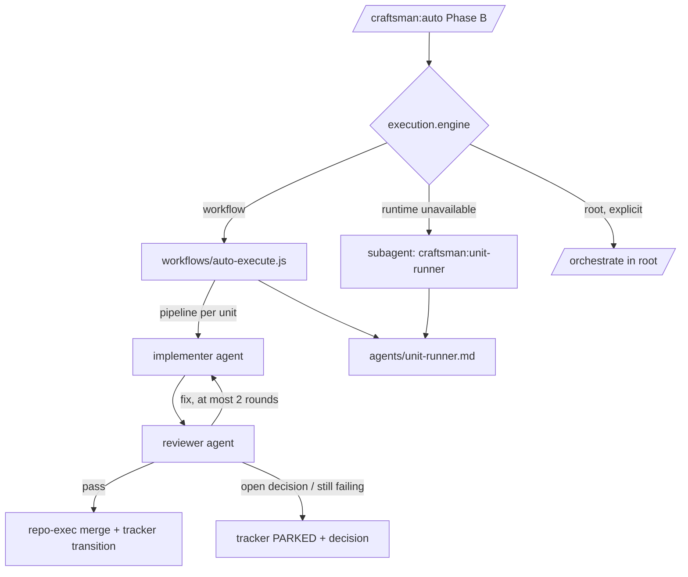

> **Human reference.** The loop never reads this file. What it enforces lives in
> [`engine.rules.md`](./engine.rules.md); if the two disagree, the rules file wins
> and `/architect --update engine` should be run.

# Engine architecture
_Last verified: 2026-10-09 at `655e17e` · Source idea: [autonomous-e2e-loop](../ideas/autonomous-e2e-loop.md)_

## In plain English
The engine is what actually runs a plan's units. There are three engines:
- **workflow** (the default): a Claude Code dynamic-workflow script shipped in
  `workflows/`. It starts one fresh implementer agent and then one fresh
  reviewer agent per unit, in plan order.
- **subagent**: the automatic fallback when workflows are unavailable. It is
  the same unit protocol, dispatched one sub-agent at a time.
- **root**: today's engine, where everything runs in the main session. It is
  now opt-in only.

The point is to keep the main session small. It holds the plan path, the
tracker, and a short summary per unit, not every file each unit read.

## How it fits

## Decisions
| id | decision | why | rejected alternatives |
|---|---|---|---|
| ARCH-ENGINE-01 | Default `workflow`, falling back to `subagent`; `root` is opt-in | User decision: adopt from day one; root context first | Default `root` until measured |
| ARCH-ENGINE-02 | The default can't land before the 1-unit spike passes | The default is otherwise unproven: guards inside agents, launch, landing | Ship and observe |
| ARCH-ENGINE-03 | Scripts only orchestrate | The runtime forbids fs/shell and non-determinism | — |
| ARCH-ENGINE-04 | One unit protocol for both engines | Prevents the engines drifting apart | Separate prompts per engine |
| ARCH-ENGINE-05 | Implementer → fresh reviewer, at most 2 rounds enforced by the script | Fresh-context review (Anthropic best practices); the round limit becomes mechanical | One agent that self-reviews (cheaper, less independent) |
| ARCH-ENGINE-06 | Schema JSON results, summaries of at most 2k tokens | Keeps root context bounded | Free-text reports |
| ARCH-ENGINE-07 | Park with a structured decision | User: never assume an open decision | Default and record |
| ARCH-ENGINE-08 | Unit context budget of 120 KB | Leaves room in a 200k window; avoids stalls | 80 KB, 200 KB |
| ARCH-ENGINE-09 | Sequential first | Parallel scope isolation is unproven | Parallel waves now |
| ARCH-ENGINE-10 | Root-context-first supersedes the total-token rationale | Explicit reversal of CHANGELOG 2.1.0 | Silent change |
| ARCH-ENGINE-11 | Rename `workflow.test.mjs` | Name collision | — |

## Data & flows
Workflow input (`args`) is the run manifest `.craftsman/runs/<slug>.json`;
see the tracker area. Each agent's output is validated JSON. Only those
summaries reach root.

## Trade-offs & known limits
Total tokens rise: two agents per unit, each re-reading its brief. Workflows
can't take user input mid-run, so open decisions park and wait for Phase C.
On Pro plans workflows need an opt-in, and the size guideline is `small`.
Partial edits from a stalled agent stay in the unit's worktree, so a
restarted run repeats the unit there.

## Glossary
- **Unit**: one plan step with its own worktree.
- **Park**: stop a unit with a reason and an optional decision, keeping its
  branch.
