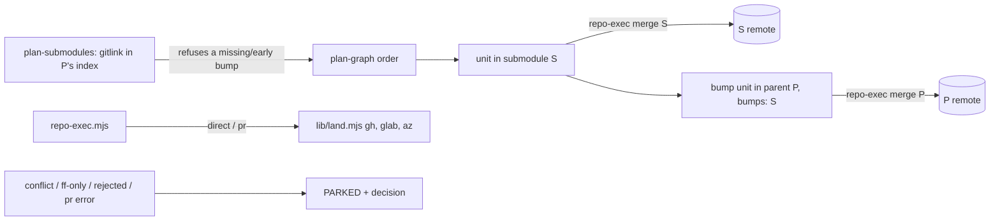

> **Human reference.** The loop never reads this file. What it enforces lives in
> [`landing.rules.md`](./landing.rules.md); if the two disagree, the rules file wins
> and `/architect --update landing` should be run.

# Landing architecture
_Last verified: 2026-10-09 at `d7da89f` · Source idea: [autonomous-e2e-loop](../ideas/autonomous-e2e-loop.md)_

## In plain English
Running `/auto` gives it full authority to commit, branch, merge, push, land
and clean up. That covers the main repo and every project registered in
`craftsman.workspace.json`, including submodules registered there. Each repo
lands its own way (a direct merge, or an auto-merging PR) in plan order. When
a submodule changes, the parent repo gets its own follow-up unit that bumps
and commits the pointer. That unit says so with `bumps: "<submodule>"`, and
`plan-graph.mjs` refuses a plan that has submodule steps but no such unit, or
whose bump unit could land before them. A project counts as a submodule when
its parent's git index holds a gitlink at its path.

It never uses force operations. It stops only for real problems, by parking
the unit for the after-run question round: a merge conflict, a failed
fast-forward, a rejected push, or a PR that won't auto-merge.

## How it fits

## Decisions
| id | decision | why | rejected alternatives |
|---|---|---|---|
| ARCH-LAND-01 | `/auto` has standing git authority | User decision | Approve each merge in Phase C |
| ARCH-LAND-02 | Each repo lands its own way, in plan order | Reuses `repo-exec` unchanged | — |
| ARCH-LAND-03 | An explicit pointer-bump unit, enforced by `plan-graph.mjs` | Reviewable, tracked, keeps repo-exec single-repo | An implicit bump in repo-exec (a hidden cross-repo write); protocol text alone |
| ARCH-LAND-04 | Registered projects only | Craftsman's explicit-workspace rule | Scanning for repos |
| ARCH-LAND-05 | No force operations | The user's CLAUDE.md and safety | — |
| ARCH-LAND-06 | Only listed failures park | User: stop only on real problems | — |

## Trade-offs & known limits
An unregistered nested repo is invisible to `/auto`; register it first. A
submodule held by an unregistered superproject at the workspace root is
refused until that root is registered. A superproject that is unregistered
and not the workspace root is not detected. The bump check runs when the plan
is checked, not again at landing. A `pr`-mode repo waits on its CI before
dependants can land.
