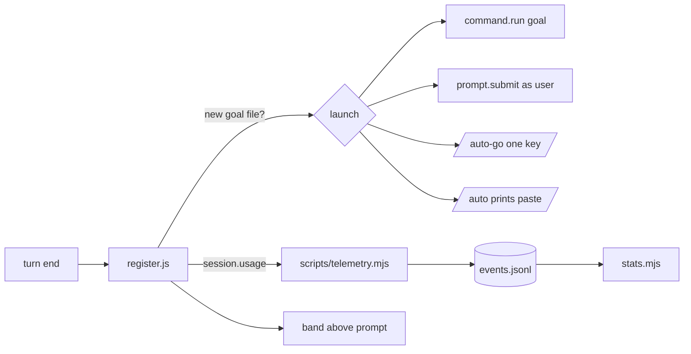

> **Human reference.** The loop never reads this file. What it enforces lives in
> [`mod.rules.md`](./mod.rules.md); if the two disagree, the rules file wins
> and `/architect --update mod` should be run.

# Mod architecture
_Last verified: 2026-10-09 at `655e17e` · Source idea: [autonomous-e2e-loop](../ideas/autonomous-e2e-loop.md)_

## In plain English
Craftsman ships a small Claude Code mod (`hooks/register.js`, v2.1.287+). It
does three things, all at zero model tokens:
- **launches** the `/goal` that `/auto` wrote, so nothing needs pasting;
- **records** root-context usage after each turn, so savings can be measured;
- **draws** a band showing plan, unit, tracker % and context %.

It never approves or blocks tool calls; craftsman's settings hooks stay the
only enforcement.

## How it fits

## Decisions
| id | decision | why | rejected alternatives |
|---|---|---|---|
| ARCH-MOD-01 | Launch, observe and draw only | Mods are unsandboxed; enforcement stays in auditable hooks | A mod that approves tool calls |
| ARCH-MOD-02 | Auto-launch, with a fallback chain | User: fully hands-off; both mechanisms are unproven, so the spike decides | One-key launch only |
| ARCH-MOD-03 | Telemetry through `events.jsonl` | One stream that `stats` already reads | A separate `telemetry.jsonl` |
| ARCH-MOD-04 | Feature-detect support at runtime | Versions and plans differ | Version string checks |
| ARCH-MOD-05 | `claude plugin test`, skipped when unsupported | The only mod test harness | — |

## Trade-offs & known limits
The mod draws nothing in `-p`, VS Code or cloud sessions, and
`disableAllHooks` stops it. Workflow-agent token totals are visible only in
`/workflows`, so telemetry measures root context, which is the metric chosen.

## Glossary
- **Band**: a strip drawn above the prompt.
- **session.usage**: the mods API call that returns context tokens and
  percent.
