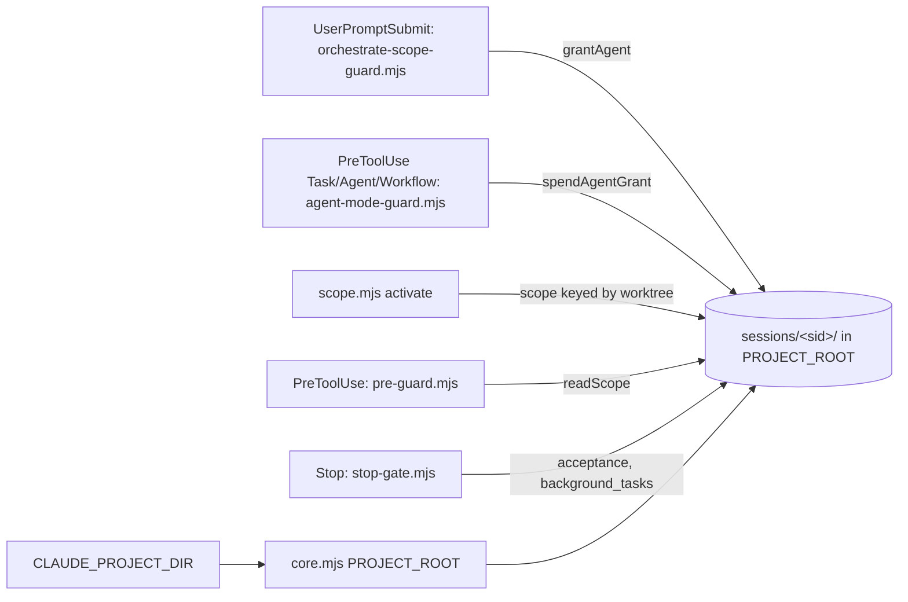

> **Human reference.** The loop never reads this file. What it enforces lives in
> [`state.rules.md`](./state.rules.md); if the two disagree, the rules file wins
> and `/architect --update state` should be run.

# State architecture
_Last verified: 2026-10-09 at `655e17e` · Source idea: [autonomous-e2e-loop](../ideas/autonomous-e2e-loop.md)_

## In plain English
Craftsman's guards keep their state under `.craftsman/sessions/<session-id>/`.
That state includes one-shot agent grants, the active scope, doc-write
authority and acceptance ownership. One hook writes a piece of state and
another hook reads it later, so both must agree on **which `.craftsman/`
folder** to use.

Today the folder follows the shell's current directory. On 2026-10-09 a
grant was written to the parent folder and checked in the repo's folder,
which blocked a legitimate dispatch. This area pins the root to what the
harness declares (`CLAUDE_PROJECT_DIR`). It also makes state safe for the
agents an autonomous run spawns. Those agents share the root's session id, so
anything per-unit is keyed by the unit's worktree instead.

## How it fits

## Decisions
| id | decision | why | rejected alternatives |
|---|---|---|---|
| ARCH-STATE-01 | Root comes from `CLAUDE_PROJECT_DIR`, never from the working directory | It's the only input every hook and script shares that can't change mid-session | Session pin file (scripts have no session id, so concurrent sessions race); "outermost candidate" (still depends on the working directory) |
| ARCH-STATE-02 | A grant's writer and spender use the same inputs | Root cause of the observed block | — |
| ARCH-STATE-03 | Per-unit scope is keyed by worktree | Agents share `session_id`; every unit already owns one worktree | Agent-id keyed (an agent can't learn its own id); sequential-only (blocks parallel waves forever) |
| ARCH-STATE-04 | The stop gate defers only the acceptance block while background work runs | Mirrors `/goal`'s own deferral; avoids the 8-block cap | Adopt acceptance ownership only in Phase C (leaves the run unguarded); rely on the cap (known failure, see CHANGELOG) |
| ARCH-STATE-05 | `Workflow` is guarded like `Task`/`Agent` | Otherwise "use a workflow" bypasses agent mode | Rely on the runtime's consent prompt |
| ARCH-STATE-06 | Sub-project grants live in the root project's session dir | Hook input has no project field | Guessing the project from the working directory (re-introduces the root split) |
| ARCH-STATE-07 | No `SubagentStop` hook | Per-unit completion is already enforced by `tracker.mjs` | Gating each agent's stop (duplicate enforcement) |

## Data & flows
Grants are one-shot files that are renamed and then unlinked when spent.
Scope files are JSON. Per-unit scopes sit beside the session scope, keyed by
a hash of the worktree path. `readScope` already picks the scope whose
worktree contains the target file.

## Trade-offs & known limits
Opening Claude Code one level above a repo now requires
`/craftsman:workspace-init`. Without it, state and config fall back to the
parent folder and the plugin defaults. The analyst also found that the
pre-guard git check uses `process.cwd()`, and it is unproven whether that
matches an agent's shell; the spike checks it.

## Glossary
- **Grant**: a one-shot permission file that lets a single isolated agent
  dispatch run.
- **sid**: the session id from hook input.
- **Spike**: the 1-unit proof run required by ARCH-ENGINE-02.
