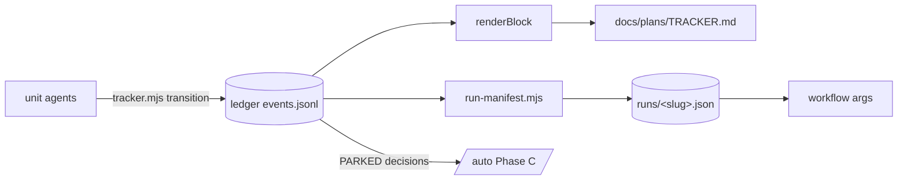

> **Human reference.** The loop never reads this file. What it enforces lives in
> [`tracker.rules.md`](./tracker.rules.md); if the two disagree, the rules file wins
> and `/architect --update tracker` should be run.

# Tracker architecture
_Last verified: 2026-10-09 at `655e17e` · Source idea: [autonomous-e2e-loop](../ideas/autonomous-e2e-loop.md)_

## In plain English
The tracker already works much like Anthropic's "feature list". It is an
append-only JSON ledger (`.craftsman/tracker/events.jsonl`) with enforced
status transitions. `docs/plans/TRACKER.md` is generated from it. The
autonomous loop adds:
- a derived per-run manifest (`.craftsman/runs/<slug>.json`) that the workflow
  takes as input;
- a structured `decision` on parked rows;
- two rules: a run can't cancel rows to look finished, and each unit runs a
  smoke test before editing.

## How it fits

## Decisions
| id | decision | why | rejected alternatives |
|---|---|---|---|
| ARCH-TRACKER-01 | The run manifest is derived from the ledger | Keeps every existing consumer working | Replace TRACKER.md with JSON (breaks pre-guard, tracker-sync and history) |
| ARCH-TRACKER-02 | Changes to event fields are additive only | Consumers spread `...event` | — |
| ARCH-TRACKER-03 | Structured `decision` on PARKED | Phase C is assembled mechanically | Free-text evidence |
| ARCH-TRACKER-04 | Autonomous runs can't emit CANCELLED | Stops a run declaring done early (Anthropic's harness findings) | — |
| ARCH-TRACKER-05 | Smoke test first | Catches breakage left by the previous unit | — |

## Trade-offs & known limits
The manifest is a cache, so a crash between a transition and regeneration
leaves it stale. It is regenerated on the next transition or read.
